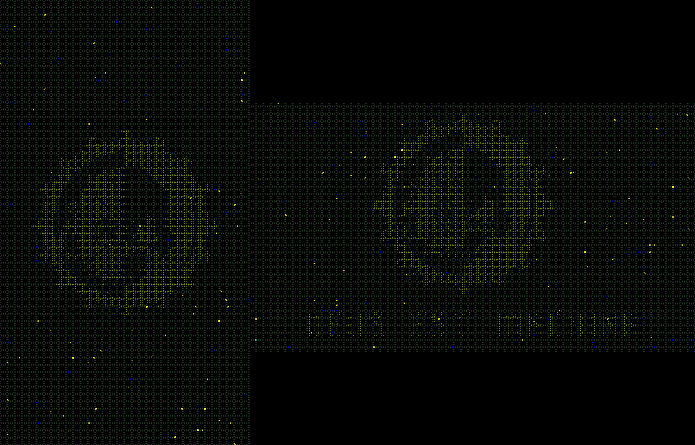

# Binary Screensaver 

Windows-скринсейвер на Python с мониторингом активности (мышь, клавиатура, звук, полноэкранные приложения).  
Запускает визуализацию (`screen_saver.py`) при простое и корректно завершает её при возобновлении активности.



## 🔧 Установка

1. **Зависимости**:
   ```bash
   pip install -r requirements.txt
### Настройка
#### Перед запуском проверьте файлы конфигурации:
	config.yaml – настройки цветов, шрифтов, мониторов и порогов активности.
	image_0.jpg, image_1.jpg – фоновые изображения для каждого монитора (можно заменить своими). цифра после "image_" это индекс монитора.
	font.ttf – файл шрифта (указан в config.yaml).

2. **Файлы конфигурации**:
config.yaml – настройки цветов, шрифтов, мониторов и порогов активности.
image_0.jpg, image_1.jpg – фоновые изображения для каждого монитора.
font.ttf – файл шрифта (указан в config.yaml).

### Запуск:
	```bash
	// python watchdog.py

🚀 Как это работает:
#### Watchdog (watchdog.py):
	Следит за активностью (ввод, звук, полноэкранные приложения).
	Запускает screen_saver.py при простое (настраивается в config.yaml).
	Автоматически завершает скринсейвер при нажатии "Esc".

#### Скринсейвер (screen_saver.py):
	Показывает анимированную матрицу с эффектами на всех мониторах.
	Динамически меняет цвета в зависимости от нагрузки CPU, памяти, диска и сети.
	Оптимизирует память через кэширование и периодическую очистку.

⚠️ Возможные проблемы и решения
#### Утечки памяти:
	В коде реализован TextureCache с автоматической очисткой.
	Совет: Убедитесь, что CACHE_SIZE в config.yaml не слишком велик.

#### "Зомби"-процессы:
	Watchdog использует terminate_subprocess() с двойной проверкой (terminate() + kill()).
	Для скринсейвера добавлен обработчик SIGTERM.

#### Ошибки аудио/мониторов:
	Проверьте, что в ignore_processes (конфиг) добавлены все фоновые приложения с звуком которые нужно игнорировать.
	Для многомониторных систем укажите правильные monitor_offsets.

